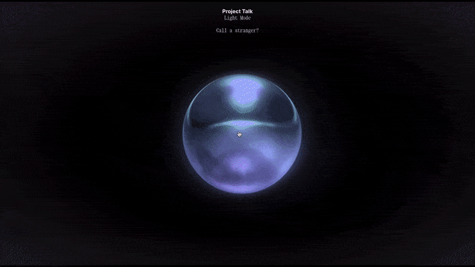

## Project Talk

  

Project Talk connects strangers through random peer-to-peer audio chats, fostering genuine human connections in our disconnected world. By prioritizing distant matches, it encourages conversations between people from diverse backgrounds. Through voice-only interactions, social anxieties are reduced, allowing for natural and comfortable conversations to unfold, revealing shared humanity beneath surface differences.

#### Install and run:

The app is currently deployed at https://pt.fly.dev/.
If you want to run it locally, follow these steps:
1. Clone the repository.
2. `cd` to the `client` directory and run `npm install && npm run build`.
3. `cd` to the `server` directory and run `npm install && tsc && npm start`.
The app is now running on `http://localhost:3000/` by default.

#### Tech stack:
Node.js, Koa, React, TypeScript, WebSockets (Socket.io), WebRTC, Cables.gl

#### Additional information:
The cables.gl patch that was created for the orb/bubble can be found here: https://cables.gl/p/mYAbMC
