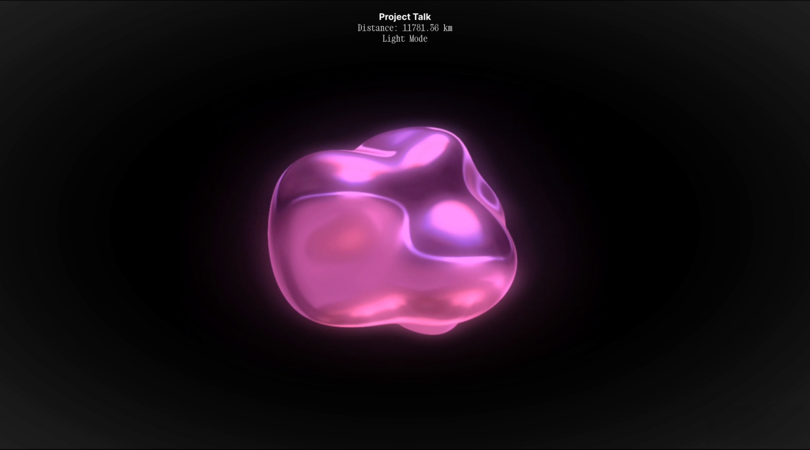

## Project Talk

  

Project Talk connects strangers through random peer-to-peer audio chats, fostering genuine human connections in our disconnected world. By prioritizing distant matches, it encourages conversations between people from diverse backgrounds. Through voice-only interactions, social anxieties are reduced, allowing for natural and comfortable conversations to unfold, revealing shared humanity beneath surface differences.

#### Install and run:
In order to quickly run the project with all its features, I highly recommend using [ngrok](https://ngrok.com/) (or similar) to tunnel the localhost:port you are using to a publicly accessible URL using SSL, as it is prohibited by most browsers to establish a WebRTC connection between peers over HTTP.

1. Make a ngrok account, and get your credentials.
2. Install ngrok on you machine and provide the credentials.
3. Run it to start the tunnel. (Just follow the simple guide on the ngrok website.)
4. Clone the repository.
5. Run `npm install` in `/server` and `/client`.
6. Create a .env file and define `PORT`, and `ORIGIN` variables.
8. Go to `client/src/components/AudioCall.tsx`, and change the `SOCKET_SERVER_URL` constant to the URL provided by ngrok.
9. `cd` to `client` and run `npm start build` there, to build the app.
10. `cd` to `server` and run `npm start` there, to build and run the server.
11. The app is now running, and accessible from the internet.

#### Tech stack:
Node.js, Koa, React, TypeScript, WebSockets (Socket.io), WebRTC, Cables.gl

#### Additional information:
The cables.gl patch that was created for the orb/bubble can be found here: https://cables.gl/p/mYAbMC
